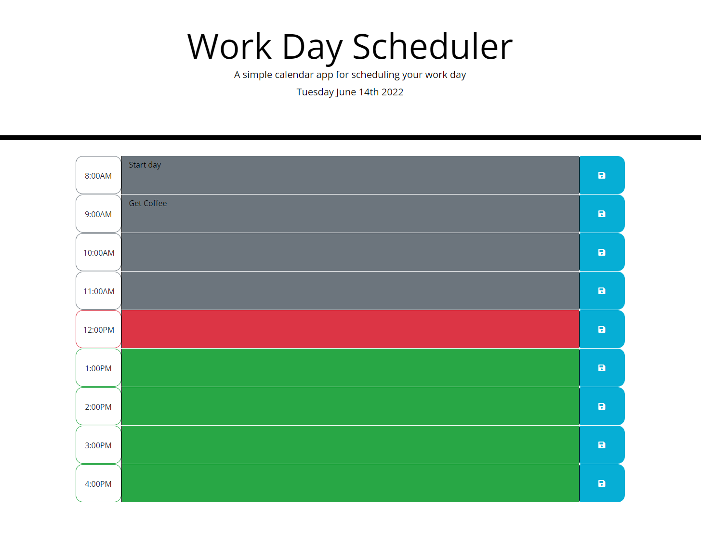

# Work Day Scheduler
​​
## Table of Contents

- [Overview](#overview)
  - [The challenge](#the-challenge)
  - [User Story](#user-story)
  - [Acceptance Criteria](#acceptance-criteria)
  - [Screenshot](#screenshots)
  - [Links](#links)
- [My process](#my-process)
  - [Built with](#built-with)
  - [What we learned](#what-we-learned)
  - [Continued development](#continued-development)
  - [Useful resources](#useful-resources)
- [Author](#author)
- [Acknowledgments](#acknowledgments)

## Overview

### The Challenge

This was a challenge to create a dynamic Work Day Scheduler that would allow the user to keep track of their tasks for the day as well as the status of their shift

### The User Story

```
AS AN employee with a busy schedule
I WANT to add important events to a daily planner
SO THAT I can manage my time effectively
```

### Acceptance Criteria

```
GIVEN I am using a daily planner to create a schedule
WHEN I open the planner
THEN the current day is displayed at the top of the calendar
WHEN I scroll down
THEN I am presented with time blocks for standard business hours
WHEN I view the time blocks for that day
THEN each time block is color-coded to indicate whether it is in the past, present, or future
WHEN I click into a time block
THEN I can enter an event
WHEN I click the save button for that time block
THEN the text for that event is saved in local storage
WHEN I refresh the page
THEN the saved events persist
```

### Screenshots

#### Example of page if user was in middle of shift

This showcases the two textarea's showing values from localStorage. It also shows what the shift coloring looks like if it is in the 12 o'clock PM hour of the day.

### Links

- Live Site URL: [workDayScheduler](https://jmonty94.github.io/workDayScheduler/)

## My Process

### Built with

- jQuery

### What I Learned

I gained further understanding of how to use jQuery to iterate over for each loops. Also I learned to make better use of variables in my code to ensure that each piece was doing what I wanted it to do allowing me to trouble shoot bugs much more effectively

### Continued Development

I would love to revisit this and create a button that displays a modal form that allows users to input their current shift start and end time. Also I would like to make the HTML be created more dynamically.

### Useful resources

- [w3Schools](https://www.w3schools.com/) - Resource with great examples and navigation between different functionality
- [MDN Web Docs](https://developer.mozilla.org/en-US/docs/Learn/JavaScript) - In-depth documentation for elements or functions
- [stackoverflow](https://stackoverflow.com/) - Answered specific questions from various collaborators
- [jQuery](https://api.jquery.com/) - resource for all of the available jQuery library

## Author

[James Montgomery](https://jmonty94.github.io/portfolio/)

## Acknowledgements

Thank you to Luigi Campbell for being very patient with me and helping me to better understand the importance of variables when writing code